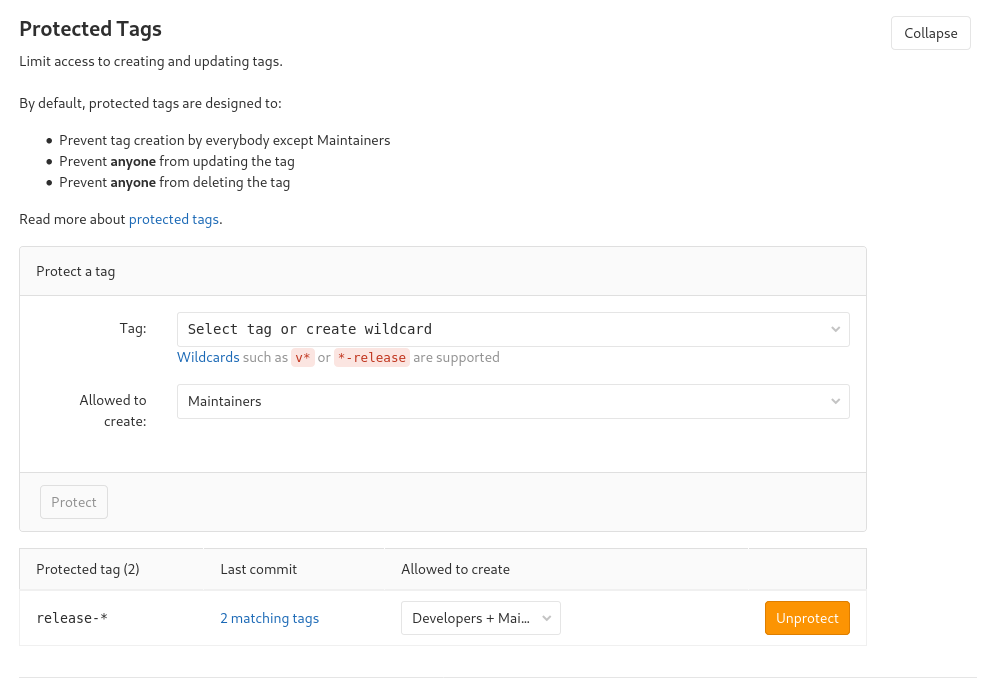
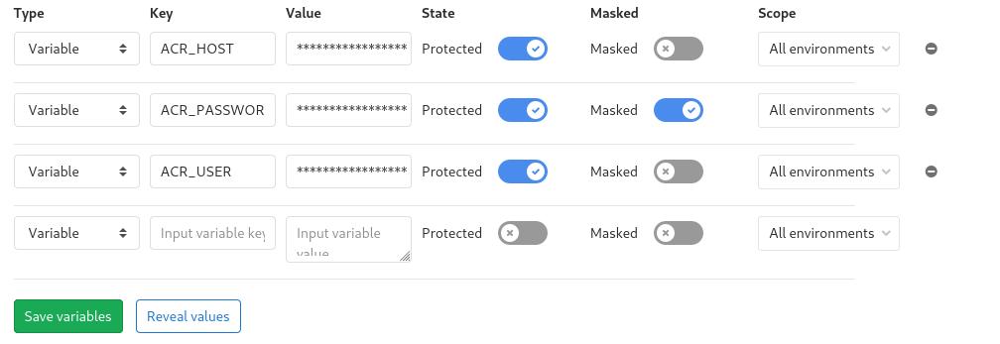

# Pipelines

To ensure only replicable builds reach our staging and production environments, we must use Continuous Intergration (CI) to build and publish images of our containerized applications.

## Adding CI to a project

### Prerequisutes

Secret environment variables are only exposed to protected tags and branches, Ensure that `release-*` tags are protected in your project.



### 1. Ensure submodules are using a relative path

- https://docs.gitlab.com/ee/ci/git_submodules.html

```
[submodule "rabbitcommunicationlib"]
	path = rabbitcommunicationlib
	url = ../../engine/RabbitCommunicationLib.git
```

### 2. Add a `.gitlab-ci.yml` in the root directory

Here is an example `publish` stage which will only execute on tags beggining with `release-`.
This pipeline, when executed will build and push an image to a pre-defined Azure Container Registry.

```yml
image: docker:stable

variables:
  GIT_SUBMODULE_STRATEGY: normal

stages:
    - release

release:

    # ENVIRONMENT REQUIREMENTS IN GITLAB CI SETTINGS
    # ACR_HOST - Hostname of the Azure container registry
    # ACR_USER - User to authenticate with the registry
    # ACR_PASSWORD - Password to authenticate with the registry

    stage: release
    only:
        - /^release-.*$/

    # Select Docker in Docker for Gitlab Shared Runners
    services:
        - docker:dind

    before_script:
        - docker info

    script:
        # Split the release tag into the semantic version number
        # eg. from `release-1.2.3` to `1.2.3`
        - SEMVER=$(echo $CI_COMMIT_TAG | cut -d "-" -f2)
        # Combine variables to the final image tag
        - IMAGE_TAG=$ACR_HOST/$CI_PROJECT_NAME:$SEMVER
        # Build the image
        - docker build --tag $IMAGE_TAG .
        # Login to the ACR container registry
        - docker login $ACR_HOST -u $ACR_USER -p $ACR_PASSWORD
        # Push the image
        - docker push $IMAGE_TAG
```

### 3. Push a release tag!


## Configuration (Gitlab Level)

This configuration should already be applied, this is for reference.

### Add Azure Container Registry (ACR) Environment Variables to Gitlab groups

Add the following Environment Variables:

- `ACR_HOST`: `mentorgg.azurecr.io`
- `ACR_PASSWORD`: *Consult DevOps*
- `ACR_USER`: *Consult DevOps*

Mark all variables as **Protected** and **Mask** `ACR_PASSWORD`.




